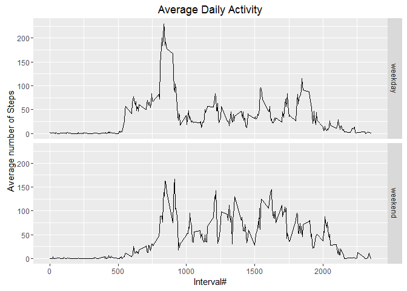

### You must have below packages installed in order to proceed:
- ggplot2
- dplyr

## Loading and preprocessing the data

Below is the code for reading in the dataset. First it will check whether the original csv file exisits in the working directory. If not, the program will stop execution. 


```r
# Checks whether the csv file exisits in the current working directory
if(!file.exists("activity.zip"))
    stop("Data set 'Activity' doesn't exist in current working directory.")
unzip("activity.zip")
```
After reading and store into a data frame, it is then converted to a data frame in **dplyr** package for the convenience of processing later on.

```r
raw <- read.csv("activity.csv", na.strings = "NA", colClasses = c("numeric", "Date", "integer"))

library(dplyr)
# Converts to data frame in dplyr package
raw.df <- tbl_df(raw)
```
Let's take a look at our raw data frame:

```r
head(raw.df)
```

```
## Source: local data frame [6 x 3]
## 
##   steps       date interval
##   (dbl)     (date)    (int)
## 1    NA 2012-10-01        0
## 2    NA 2012-10-01        5
## 3    NA 2012-10-01       10
## 4    NA 2012-10-01       15
## 5    NA 2012-10-01       20
## 6    NA 2012-10-01       25
```
We can see many NAs in this data frame.

## What is mean total number of steps taken per day?

We will ignore the missing values in the dataset for now. Below is the code to calculate the total number of steps taken per day.


```r
steps.per.day <- raw.df %>% group_by(date) %>% summarize(sum.steps = sum(steps, na.rm = TRUE))
head(steps.per.day)
```

```
## Source: local data frame [6 x 2]
## 
##         date sum.steps
##       (date)     (dbl)
## 1 2012-10-01         0
## 2 2012-10-02       126
## 3 2012-10-03     11352
## 4 2012-10-04     12116
## 5 2012-10-05     13294
## 6 2012-10-06     15420
```
We will use this result to product a historgram using ggplot2 base.

```r
library(ggplot2)
qplot(sum.steps, data=steps.per.day) + 
    labs(title="Histogram of Total Steps per Day") + 
    xlab("Total number of Steps") +
    ylab("Count of Days")
```

<!-- -->

The mean and median can be properly calculated and formatted as:

```r
mean <- format(mean(steps.per.day$sum.steps), nsmall=2)
median <- format(median(steps.per.day$sum.steps), nsmall=2)
```
So the mean of total number of steps taken per day is **9354.23** and the median of the same is **10395.00**.

## What is the average daily activity pattern?
This can be answered by making a time series plot of the 5-minute interval (x-axis) and the average number of steps taken, averaged across all days (y-axis). Let's first get the data ready.

```r
steps.per.intv <- raw.df %>% group_by(interval) %>% summarize(avg.steps = mean(steps, na.rm = TRUE))
```
Below shows a time series plot of the average steps vs 5-min intervals.

```r
ggplot(steps.per.intv, aes(interval, avg.steps)) + geom_line() +
    labs(x = "Interval#", y = "Average number of Steps", title = "Average Daily Activity")
```

<!-- -->

Which 5-minute interval, on average across all the days in the dataset, contains the maximum number of steps?

```r
max.i <- which(steps.per.intv$avg.steps==max(steps.per.intv$avg.steps, na.rm = TRUE))
max.intv <- steps.per.intv[max.i,]$interval
max.steps <- format(steps.per.intv[max.i,]$avg.steps, nsmall=2)
```
We now know it is during interval **835** the average number of steps reaches maximum of **206.1698**.

## Imputing missing values
As we discussed earlier, there are a number of days/intervals where there are missing values (coded as NA). The presence of missing days may introduce bias into some calculations or summaries of the data.

```r
na.sum <- sum(is.na(raw$steps))
```
There are **2304** missing values in total. We will impute these missing values by using the average number of steps for that interval across all days. We have already calculated this data:

```r
head(steps.per.intv)
```

```
## Source: local data frame [6 x 2]
## 
##   interval avg.steps
##      (int)     (dbl)
## 1        0 1.7169811
## 2        5 0.3396226
## 3       10 0.1320755
## 4       15 0.1509434
## 5       20 0.0754717
## 6       25 2.0943396
```
Below is the code to produce a new dataset with all missing values filled. Basically, first the original data frame is joined by the average number of steps per interval, based on a common column **interval**.

```r
new.df <- left_join(raw.df, steps.per.intv)
```

```
## Joining by: "interval"
```
Then if the steps is NA, it will be replaced by the avg.steps.

```r
na.i.new <- which(is.na(new.df$steps))
new.df[na.i.new, ]$steps = new.df[na.i.new,]$avg.steps
new.df <- select(new.df, -avg.steps) # Re-arranging to be in the same format as original
```
Our new data frame looks like this:

```r
head(new.df)
```

```
## Source: local data frame [6 x 3]
## 
##       steps       date interval
##       (dbl)     (date)    (int)
## 1 1.7169811 2012-10-01        0
## 2 0.3396226 2012-10-01        5
## 3 0.1320755 2012-10-01       10
## 4 0.1509434 2012-10-01       15
## 5 0.0754717 2012-10-01       20
## 6 2.0943396 2012-10-01       25
```
We generate again the histogram for total number of steps each day using qplot function.

```r
steps.per.day.new <- new.df %>% group_by(date) %>% summarize(sum.steps = sum(steps, na.rm = TRUE))
qplot(sum.steps, data=steps.per.day.new) + 
    labs(title="Histogram of Total Steps per Day") + 
    xlab("Total number of Steps") +
    ylab("Count of Days")
```

<!-- -->

Now look at the mean and median:

```r
mean.new <- format(mean(steps.per.day.new$sum.steps), nsmall=2)
median.new <- format(median(steps.per.day.new$sum.steps), nsmall=2)
```
So the new mean of total number of steps taken per day is **10766.19** (vs. old mean = **9354.23**) and the new median of the same is **10766.19** (vs. old median = **10395.00**). The imputing strategy used above has increased both the mean and median total number of steps per day.

# Are there differences in activity patterns between weekdays and weekends?
We will first create a new factor variable in the dataset with two levels - "weekday" and "weekend" indicating whether a given date is a weekday or weekend day.

```r
new.df <- mutate(new.df, day.type = factor(weekdays(date) %in% c("Sunday", "Saturday"), 
                                           labels=c("weekday", "weekend")))
```
Now make a panel plot containing a time series plot of the 5-minute interval (x-axis) and the average number of steps taken, averaged across all weekday days or weekend days (y-axis).

```r
steps.per.intv.new <- new.df %>% group_by(interval, day.type) %>% 
    summarize(avg.steps = mean(steps, na.rm = TRUE))
ggplot(steps.per.intv.new, aes(interval, avg.steps)) + geom_line() + facet_grid(day.type ~ .) +
    labs(x = "Interval#", y = "Average number of Steps", title = "Average Daily Activity")
```

<!-- -->
